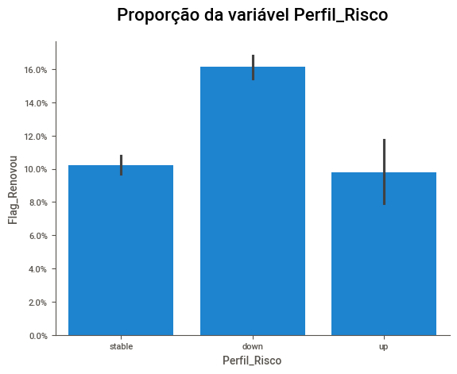
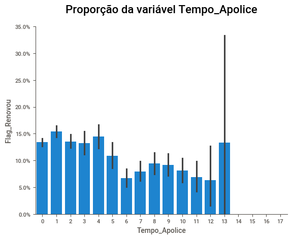
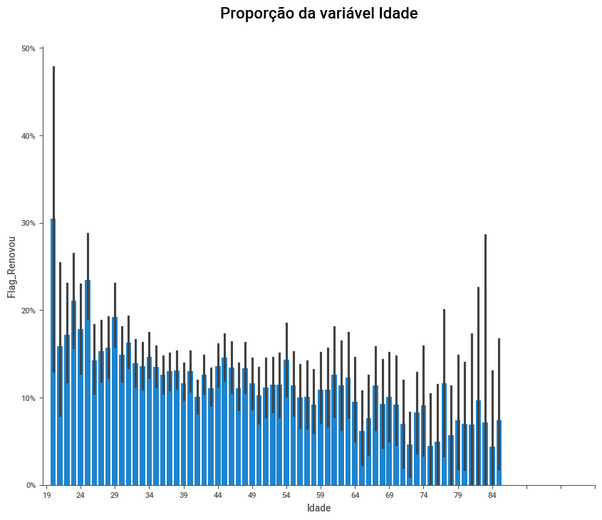
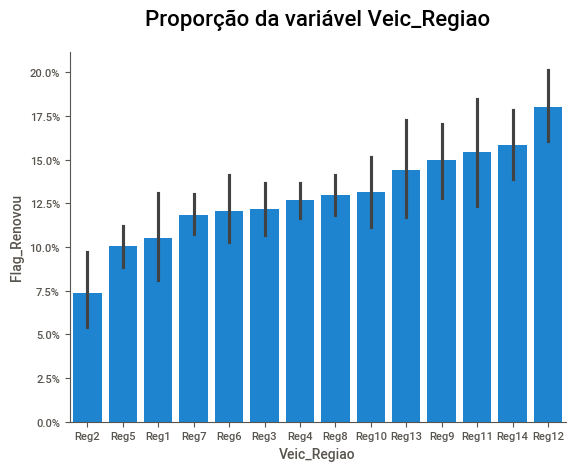
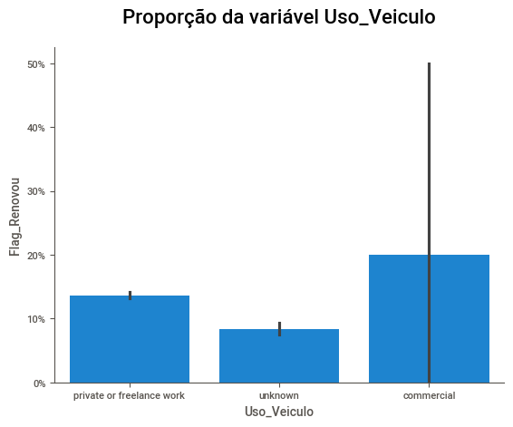

# Renovação de seguros

## 📌 Visão Geral

Este projeto teve como objetivo analisar os dados da empresa de seguros **SeguraAí** a fim de identificar os fatores associados à não renovação dos seguros de veículos e indicar ações que poderiam ter sido implementadas para mitigar esse problema.

## 💼 Entendimento do Negócio

A SeguraAí é uma fintech de venda de seguros para pessoas físicas. No ramo de Seguros, a recorrência de gastos dos clientes vem da **renovação das apólices**.

---

As seguradoras avaliam os riscos que os segurados enfrentam em relação à saúde, propriedade, vida, veículos, entre outros.

Com essa avaliação de riscos, histórico do segurado, coberturas escolhidas e outros fatores, é calculado os **prêmios** (preço do seguro) que os segurados devem pagar em troca da cobertura oferecida.

Após o acordo entre as partes envolvidas, é emitido a **apólice de seguro**, documento que detalha os termos, condições e limites da cobertura
Os segurados pagam regularmente os prêmios à seguradora para manter a cobertura ativa. As **seguradoras também mantêm reservas financeiras** para garantir os fundos necessários para cobrir reclamações futuras.

Quando ocorre um evento coberto pela apólice, os segurados apresentam uma **reclamação de sinistro** (quando o item segurado é comprometido) à seguradora. A empresa avalia a validade da reclamação e, se aprovada, paga a indenização ou fornece os serviços especificados na apólice.

>*As seguradoras operam dentro de um ambiente regulatório para garantir que sigam as leis e regulamentos aplicáveis. No Brasil, a SUSEP é o órgão responsável pelo controle e fiscalização dos mercados de seguros, previdênci privada aberta, capitalização e resseguro*

## 📊 Análise exploratória de dados

### [📘 Notebook - Análise exploratória de dados](https://github.com/Mathsnts18/renovacao_seguros/blob/main/notebooks/analise_exploratoria.ipynb)

[💾 Relatório - Faça o download](https://github.com/Mathsnts18/renovacao_seguros/blob/main/notebooks/SWEETVIZ_REPORT.html)

Foram realizadas análises completas das variáveis disponibilizadas, avaliando seus pormenores e aplicando tratamentos necessários.

Para automação do projeto, foi utilizado a biblioteca [sweetviz](https://pypi.org/project/sweetviz/#description) para a criação do relatório. A análise revelou:

**Flag_Renovou**

- Variável target.
- Desbalanceada: 0 aparece em 87%.

**Idade**

- 50% dos clientes tinham idade entre 35 e 49 anos.

**Perfil_Risco**

- Clientes renovavam mais frequentemente quando seu perfil de risco diminuía (`down`).

**Diferenca_Perfil**

- A maioria dos clientes adquiria o seguro para si ou para seus parceiros como motoristas.
- Clientes mais jovens tinham maior probabilidade de renovar.

**Genero**

- 64% da base era composta por homens.

**Profissao**

- 41% eram médicos.

**Tempo_Apolice**

- 50% da base possuía até um ano de apólice.
- A tendência era a não renovação com o passar do tempo.

**Uso_Veiculo**

- A grande maioria, 85%, utilizava o veículo para uso pessoal.
- Veículos utilizados apenas para fins comerciais tinham maior chance de renovação, embora houvesse poucas amostras nessa categoria.

**Qte_Apolices**

- Quase 80% da base possuía, no máximo, uma apólice.

**Premio_Final**

- A mediana do valor pago pelos clientes era de $312.
- 75% dos clientes pagavam até $448.

**Premio_Qte_Parc**

- 51% dos clientes preferiam pagar em apenas uma parcela.

**Premio_Pago_Ult**

- A mediana do valor pago no último ano era de $311.
- 75% dos clientes haviam pago até $450.
- Os valores eram praticamente idênticos aos do ano atual.

**Premio_Mercado**

- A mediana do valor aproximado do mercado era de $317.
- 75% do mercado oferecia valores até $434.
- Os valores praticados estavam condizentes com o mercado.

**Premio_Orig**

- A mediana do valor estipulado pela área de pricing era de $301.
- 75% estipulavam valores até $424.
- Os valores eram menores em comparação ao prêmio pago pelos clientes.

**Veic_Idade**

- 50% dos veículos tinham entre 11 e 16 anos.

**Veic_Idade_Compra**

- 50% dos veículos haviam sido adquiridos entre com 4 e 11 anos de fabricação.

### ℹ️ Information Value

A técnica de Information Value (IV)  nos fornece o "poder de separação" que uma variável qualitativa de duas ou mais categorias possui sobre outra variável binária.

Em nosso dataset não obtivemos nenhuma variável com o IV acima de 0,07, que no benchmark mais tradicional, não passa de um poder de separação fraco com a variável target, `Flag_Renovou`

| IV Total   | Poder de separação                      |
| ---------- | --------------------------------------- |
| < 0,02     | Muito fraco                             |
| 0,02 a 0,1 | Fraco                                   |
| 0,1 a 0,3  | Médio                                   |
| 0,3 a 0,5  | Forte                                   |
| > 0,5      | Comportamento suspeito |

| Variavel   | IV   |
| ---------- | ---- |
Perfil_Risco | 0.07 |
Tempo_Apolice| 0.06 |
Idade        | 0.04 |
Veic_Regiao  | 0.03 |
Uso_Veiculo  | 0.03 |

### 🤔 Testes de hipótese

Para análises mais robustas, foram aplicadas técnicas de testes de hipótese para verificar se as proporções diferiam significativamente entre os grupos.

Utilizando o teste Z para proporção, com um nível de significância (alpha) de 0,05:

$H_0: \text{Proporções iguais}$

$H_a: \text{Proporções diferentes}$

Caso o p-valor fosse menor que alpha, a hipótese nula ($H_0$) seria rejeitada, indicando diferenças significativas entre as proporções.

Resultados:

**Perfil_Risco**

- Segurados com perfil de risco diminuído tinham maior probabilidade de renovar a apólice.

**Tempo_Apolice**

- Segurados com menos tempo de apólice renovavam mais frequentemente.

**Idade**

- Segurados com menos de 38 anos tinham maior probabilidade de renovar.

**Veic_Regiao**

- Algumas regiões apresentavam maior probabilidade de renovação, como a região 12 em comparação com a região 2.
- As taxas de renovação de cada região podem ser visualizadas na tabela de IV de `Veic_Regiao` a partir da coluna `Odds` (valores acima de 1.0 há mais probabilidade de renovação).

**Uso_Veiculo**

- Temos poucas amostras para a categoria de uso comercial, logo não podemos ter confiança nessa categoria.
- Segurados que utilizavam o veículo para fins privados tinham maior probabilidade de renovação em relação à categoria "desconhecido".
- Devemos entender o que significa o valor "desconhecido" da variável para poder ter afirmações mais contundentes.

## 🎯 Planos de Ação

Com as análises realizadas, temos um melhor embasamento para desenvolver estratégias a fim de diminuir a não renovação de seguros, como:

 ### Ações baseadas no perfil de risco

- **Comunicação personalizada**: Envio de mensagens destacando vantagens para clientes com perfil de risco diminuído.
- **Incentivos para melhorar o perfil de risco**: Ofertas de descontos ou bônus para clientes que adotassem medidas de segurança, como instalação de rastreadores.

### Foco em clientes com pouco tempo de apólice

- **Campanhas de retenção**: Ações específicas para engajar clientes com até 1 ano de apólice.

### Segmentação por faixa etária

- **Ofertas direcionadas**: Criação de pacotes para clientes abaixo de 38 anos.

**Idade análisada no projeto*

- **Educação financeira**: Promoção de conteúdos educativos sobre seguros.

### Atenção às regiões com baixa renovação

- **Estudo detalhado das regiões**: Análise dos motivos de baixa renovação em regiões específicas.
- **Parcerias locais**: Estabelecimento de parcerias com empresas regionais.

## 🏁 Conclusão Final

A análise detalhada dos dados da **SeguraAí** revelou insights valiosos sobre os fatores associados à não renovação das apólices de seguro. A identificação de padrões, como a relação entre tempo de apólice, perfil de risco e idade, destaca oportunidades claras para intervenções estratégicas.

Os próximos passos envolveriam a implementação dos planos de ação propostos, com monitoramento contínuo e aprimoramento das análises.

Este projeto demonstrou como a análise de dados pode identificar oportunidades para melhoria de processos e aumento da fidelização dos clientes.
