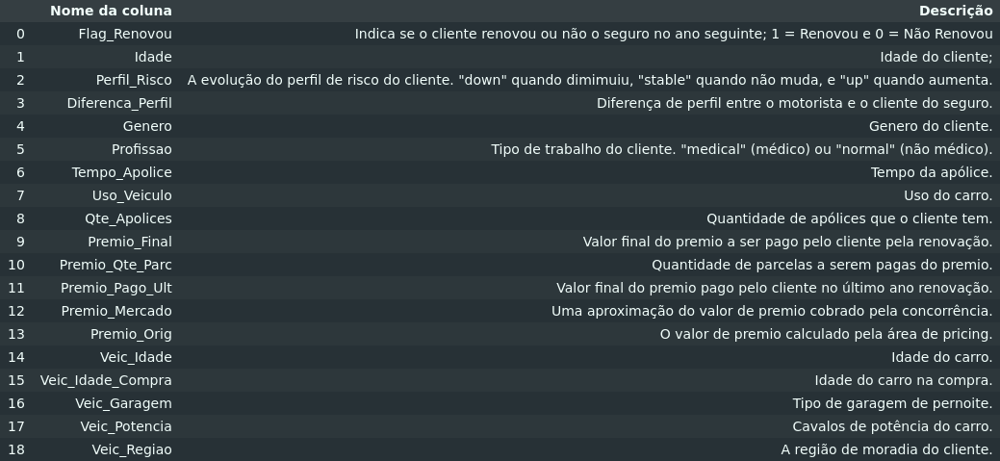
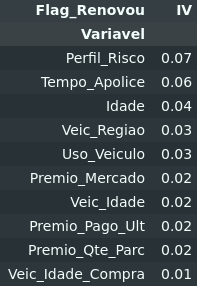
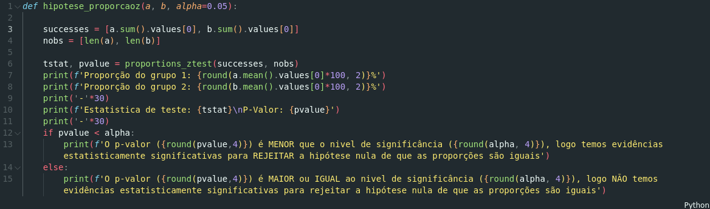

# Renovação de seguros

## 📌 Visão Geral

Este projeto visa analisar os dados da empresa de seguros **SeguraAí** a fim de análisar os fatores que estão associados a não renovação dos seguros de veiculos e indicar ações que a empresa pode fazer para diminuir esse problema.

## 💼 Entendimento do Negócio

A SeguraAí é uma fintech de venda de seguros para pessoas físicas. No ramo de Seguros, a recorrência de gastos dos clientes vem da **renovação das apólices**.

---

As seguradoras avaliam os riscos que os segurados enfrentam em relação à saúde, propriedade, vida, veículos, entre outros.

Com essa avaliação de riscos, histórico do segurado, coberturas escolhidas e outros fatores, é calculado os **prêmios** (preço do seguro) que os segurados devem pagar em troca da cobertura oferecida.

Após o acordo entre as partes envolvidas, é emitido a **apólice de seguro**, documento que detalha os termos, condições e limites da cobertura
Os segurados pagam regularmente os prêmios à seguradora para manter a cobertura ativa. As **seguradoras também mantêm reservas financeiras** para garantir os fundos necessários para cobrir reclamações futuras.

Quando ocorre um evento coberto pela apólice, os segurados apresentam uma **reclamação de sinistro** (quando o item segurado é comprometido) à seguradora. A empresa avalia a validade da reclamação e, se aprovada, paga a indenização ou fornece os serviços especificados na apólice.

>*As seguradoras operam dentro de um ambiente regulatório para garantir que sigam as leis e regulamentos aplicáveis. No Brasil, a SUSEP é o órgão responsável pelo controle e fiscalização dos mercados de seguros, previdênci privada aberta, capitalização e resseguro*

## 📊 Análise exploratória de dados

### [📘 Notebook - Análise exploratória de dados](notebooks\analise_exploratoria.ipynb)

[💾 Relatório](notebooks/reports/SWEETVIZ_REPORT.html)

Foram feitas análises completas das variáveis disponibilizadas, avaliando seus por menores e realizando o tratamento se necessário.

Para automação do projeto, foi utilizado a biblioteca [sweetviz](https://pypi.org/project/sweetviz/#description) para a criação do relatório onde pudemos observar que:

**Flag_Renovou**

- Variável target
- Desbalanceada: 0 aparece em 87%

**Idade**

- 50% dos clientes tem idade entre 35 a 49 anos

**Perfil_Risco**

- Aparentemente os clientes tendem a renovar quando o seu perfil de risco diminui (`down`)

**Diferenca_Perfil**

- A maioria dos clientes adquirem o seguro sendo eles mesmos ou os parceiros como motorista
- Clientes mais novos tendem a renovar

**Genero**

- 64% de nossa base é composta por homens

**Profissao**

- 41% são médicos.

**Tempo_Apolice**

- 50% da nossa base possui até um ano de apolice
- A tendencia é a não renovação com o passar do tempo

**Uso_Veiculo**

- A grande maioria, 85%, tem o véiculo para uso pessoal
- Veiculos que são usados apenas para uso comercial tem um chance maior de renovação, porém há poucas amostras nessa categoria

**Qte_Apolices**

- Quase 80% da nossa base possui no máximo uma apólice

**Premio_Final**

- A mediana do valor a ser pago pelo cliente é de $312
- 75% dos clientes pagam até $448

**Premio_Qte_Parc**

- 51% dos clientes preferem pagar em apenas uma parcela

**Premio_Pago_Ult**

- A mediana do valor pago pelo cliente no ultimo ano é de $311
- 75% dos clientes pagaram até $450
- Os valores se apresentam praticamente identicos ao do ano atual

**Premio_Mercado**

- A mediana do valor aproximado do mercado é de $317
- 75% do mercado oferece até $434
- Nossos valores estão condizentes com o mercado atual

**Premio_Orig**

- A mediana do valor estipulado pela área de pricing é $301
- 75% estipula até $424
- Temos um valor menor se comparado ao valor do premio pago pelo cliente

**Veic_Idade**

- 50% dos veiculos da nossa base possuem de 11 a 16 anos

**Veic_Idade_Compra**

- 50% dos veiculos da nossa base foram adquiridos entre 4 a 11 anos

### ℹ️ Information Value

A técnica de Information Value (IV)  nos fornece o "poder de separação" que uma variável qualitativa de duas ou mais categorias possui sobre outra variável binária.

Em nosso dataset não obtivemos nenhuma variável com o IV acima de 0,07, que no benchmark mais tradicional, não passa de um poder de separação fraco com a variável target, `Flag_Renovou`

| IV Total   | Poder de separação                      |
| ---------- | --------------------------------------- |
| < 0,02     | Muito fraco                             |
| 0,02 a 0,1 | Fraco                                   |
| 0,1 a 0,3  | Médio                                   |
| 0,3 a 0,5  | Forte                                   |
| > 0,5      | Comportamento suspeito |

| Variavel	| IV |
| --- | --- |
Perfil_Risco | 0.07
Tempo_Apolice|0.06
Idade|0.04
Veic_Regiao|0.03
Uso_Veiculo|0.03

Para obter uma análise mais robusta, utilizarei de técnicas de testes de hipótese para verificar se essas proporções são realmente diferentes entre si

### 🤔 Testes de hipótese

Como padrão do teste Z para proporção, temos:

$H_0: \text{Proporções iguais}$

$H_a: \text{Proporções diferentes}$

Com o nível de significância (alpha) padrão de 0,05.
Caso o p-valor seja **menor** que alpha, podemos rejeitar a hipótese nula ($H_0$) e afirmar que temos evidências estatisticamentes significativas para afirmar que as proporções são diferentes entre os grupos.

A partir disso obtivemos os seguintes resultados:

**Perfil_Risco**

- Os segurados que tiveram seu perfil de risco **diminuído** tem uma probabilidade maior de renovar a apólice.

**Tempo_Apolice**

- Os segurados que possui um tempo de apólice **menor** tem uma probabilidade maior de renovar a apólice.

**Idade**

- Os segurados com uma idade **menor do que 38 anos** tem uma probabilidade maior de renovar a apólice.

**Veic_Regiao**

- Existem regiões onde é mais provável que o segurado renove a apólice.
- No estudo análisamos a região 12 em relação a região 2 e verificamos uma alta diferença de proporção.
- As taxas de renovação de cada região podem ser visualizadas na tabela de IV de `Veic_Regiao` a partir da coluna `Odds` (valores acima de 1.0 há mais probabilidade de renovação).

**Uso_Veiculo**

- Temos poucas amostras para a categoria de uso comercial, logo não podemos ter confiança nessa categoria.
- Os segurados com o uso do veículo privado tem uma maior chance de renovar a apólice em relação ao uso "desconhecido".
- Devemos entender o que significa o valor "desconhecido" da variável para poder ter afirmações mais contundentes.

## 🎯 Planos de Ação

Com as análises realizadas, temos um melhor embasamento para desenvolver estratégias a fim de diminuir a não renovação de seguros, como:

 ### Ações baseadas no perfil de risco

- **Comunicação personalizada**: Enviar comunicados destacando as vantagens de renovação para clientes com perfil de risco diminuído.
- **Incentivos para melhorar o perfil de risco**: Oferecer descontos ou bônus para clientes que adotem medidas de segurança, como instalação de rastreadores ou cursos de direção defensiva.

### Foco em clientes com pouco tempo de apólice

- **Campanhas de retenção**: Desenvolver ações para engajar clientes com até 1 ano de apólice, como descontos progressivos para renovação.

### Segmentação por faixa etária

- **Ofertas direcionadas**: Criar pacotes específicos para clientes abaixo de 38* anos, com serviços ou benefícios que atraiam esse público.

**Idade análisada no projeto*

- **Educação financeira**: Promover conteúdos educativos sobre a importância de seguros para clientes mais jovens

### Atenção às regiões com baixa renovação

- **Estudo detalhado das regiões**: Investigar os motivos que levam à baixa renovação em determinadas regiões.
- **Parcerias locais**: Estabelecer parcerias com oficinas, concessionárias ou eventos regionais para fortalecer a presença da marca.

## 🏁 Conclusão Final

A análise detalhada dos dados da **SeguraAí** revelou insights valiosos sobre os fatores associados à não renovação das apólices de seguro. A identificação de padrões, como a relação entre tempo de apólice, perfil de risco e idade, destaca oportunidades claras para intervenções estratégicas.

Os próximos passos a serem colocados em prática são o de implementar os planos de ação propostos, com monitoramento contínuo para avaliar cada estratégia e aprimorar os dados, como o "uso desconhecido" e assim refinar as análises.

Este projeto demonstra como a análise de dados pode revelar oportunidades valiosas para a melhoria dos processos de negócio e o aumento da fidelização dos clientes!